Horror Movie Profits
================
Gaurav Sharma
29/08/2020

### lets fetch in the data for today’s data exploration task

``` r
ttfile <- tidytuesdayR::tt_load("2018-10-23")
```

    ## 
    ##  Downloading file 1 of 1: `movie_profit.csv`

``` r
movie_profit_raw <- ttfile$movie_profit

movie_profit <- movie_profit_raw %>%
  select(-X1) %>%
  mutate(release_date = parse_date(release_date, "%m/%d/%Y")) %>%
  filter(release_date < "2018-01-01") %>%
  mutate(distributor = fct_lump(distributor, 6)) %>%
  mutate(profit_ratio = worldwide_gross/production_budget,
         Decade = 10 * floor(year(release_date)/10)) %>% 
  drop_na() %>% 
  filter(worldwide_gross > 0) %>% 
  select(release_date, Decade, movie, production_budget:worldwide_gross,profit_ratio, genre, everything())
```

### Lets have a look at the distribution of production budget

``` r
movie_profit %>% 
    ggplot(aes(production_budget)) +
    geom_histogram() +
    scale_x_log10(labels = dollar_format())
```

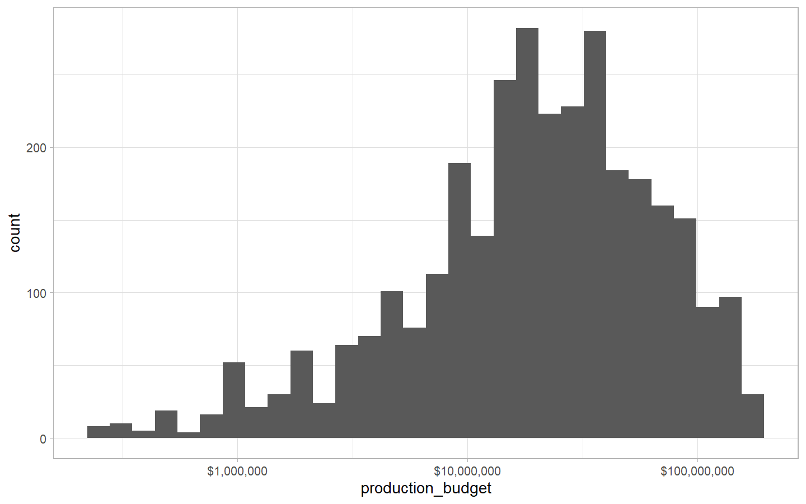<!-- -->

### How many distributirs are there

``` r
movie_profit %>% 
    count(distributor, sort = T)
```

    ## # A tibble: 7 x 2
    ##   distributor            n
    ##   <fct>              <int>
    ## 1 Other               1444
    ## 2 Warner Bros.         349
    ## 3 Sony Pictures        326
    ## 4 Universal            275
    ## 5 20th Century Fox     269
    ## 6 Paramount Pictures   251
    ## 7 Walt Disney          236

### How do big production houses spend in erms of production buudget. Lets see

``` r
movie_profit %>%
  mutate(distributor = fct_reorder(distributor, -production_budget)) %>% 
  ggplot(aes(distributor, production_budget)) +
  geom_boxplot(fill = "purple",
               alpha = 0.9,
               color = "gray") +
  scale_y_log10(labels = dollar_format()) +
  coord_flip()
```

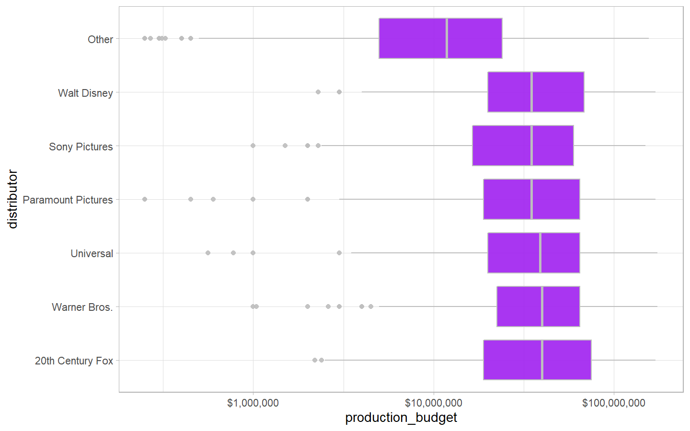<!-- -->

``` r
movie_profit %>% 
    pivot_longer(4:6, "category", "value") %>% 
    ggplot(aes(distributor, value)) +
    geom_boxplot(fill = "purple", alpha = 0.9, color = "gray") +
    scale_y_log10(labels = dollar_format()) +
    coord_flip() +
    facet_wrap(~category, nrow = 3)
```

<!-- -->

``` r
movie_profit %>%
  mutate(genre = fct_reorder(genre, -production_budget)) %>% 
  ggplot(aes(genre, production_budget)) +
  geom_boxplot(fill = "purple",
               alpha = 0.9,
               color = "gray") +
  scale_y_log10(labels = dollar_format()) +
  coord_flip()
```

<!-- -->

``` r
movie_profit %>% 
    pivot_longer(4:6, "category", "value") %>% 
    ggplot(aes(genre, value)) +
    geom_boxplot(fill = "pink", color = "gray") +
    scale_y_log10(labels = dollar_format()) +
    coord_flip() +
    facet_wrap(~category, nrow = 3)
```

<!-- -->

### What are typical budgets over time (Over years)

``` r
movie_profit %>% 
  mutate(Year = year(release_date)) %>% 
  ggplot(aes(Year, production_budget, fill = distributor)) +
  geom_col() +
  facet_wrap(~distributor) +
  theme(legend.position = "none")
```

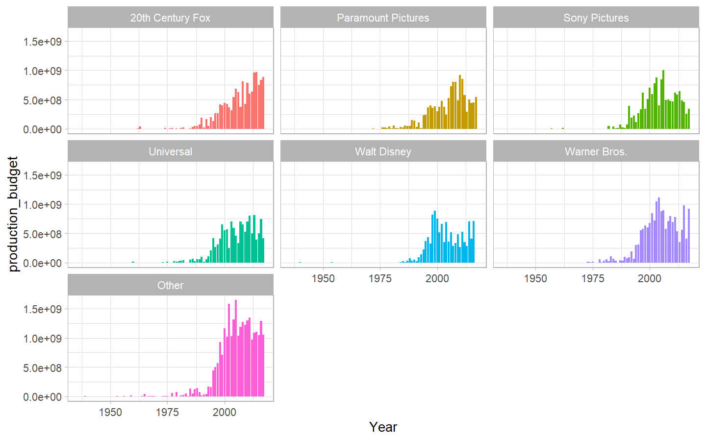<!-- -->

### What are typical budgets over time (Over decades)

``` r
movie_profit %>% 
  group_by(Decade) %>% 
  summarise_at(vars(production_budget:worldwide_gross), median, na.rm = T) %>% 
  pivot_longer(-Decade, "metric", "value") %>% 
  ggplot(aes(Decade, value, color = metric)) +
  geom_line(size = 1.5) +
  scale_y_log10(labels = dollar_format())
```

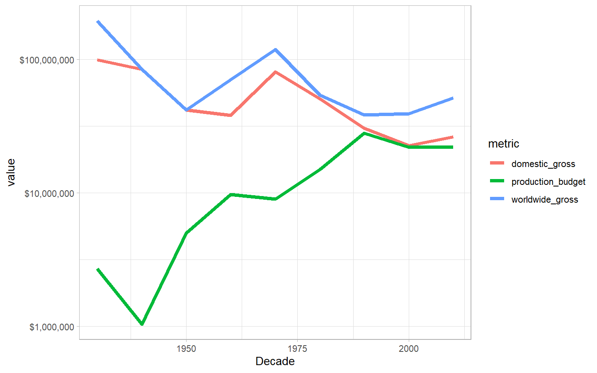<!-- -->

``` r
movie_profit %>% 
  mutate(profit_ratio = worldwide_gross/production_budget) %>% 
  ggplot(aes(profit_ratio)) +
  geom_histogram() +
  scale_x_log10(labels = scales::ordinal_format())
```

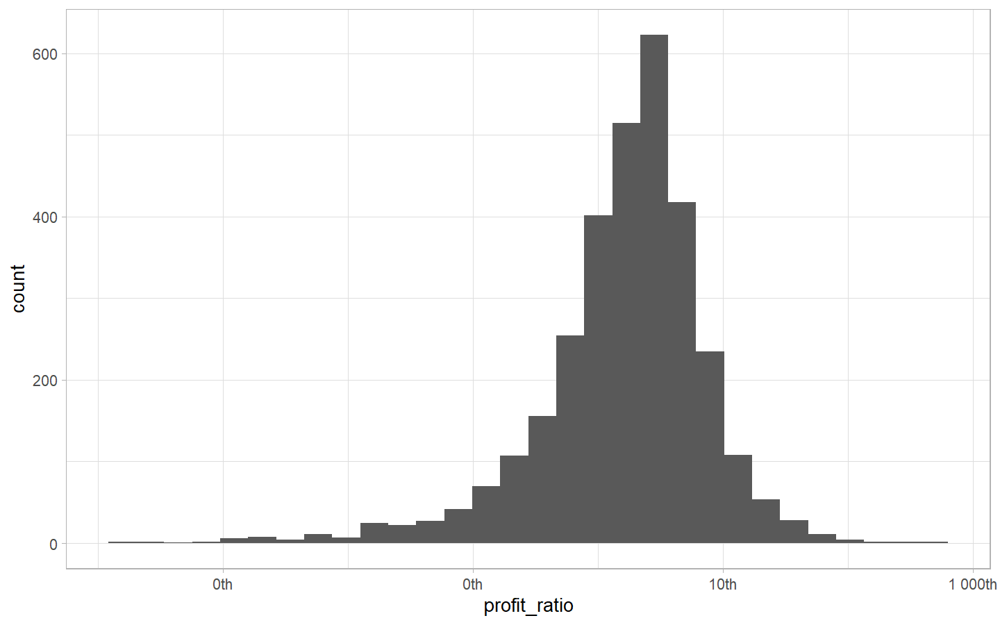<!-- -->

``` r
movie_profit %>% 
  mutate(profit_ratio = worldwide_gross/production_budget,
         genre = fct_reorder(genre, profit_ratio)) %>% 
  ggplot(aes(genre, profit_ratio)) +
  geom_boxplot() +
  scale_y_log10(labels = ordinal_format()) +
  coord_flip()
```

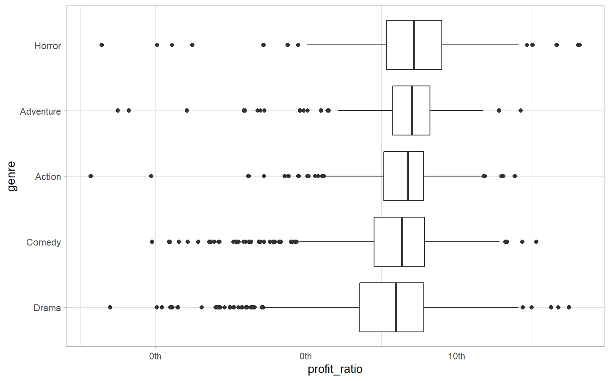<!-- -->

``` r
movie_profit %>% 
  group_by(genre) %>% 
  summarise(median_profit_ratio = median(profit_ratio)) %>% 
  arrange(desc(median_profit_ratio)) %>% 
  mutate(genre = fct_reorder(genre, median_profit_ratio)) %>% 
  ggplot(aes(genre, median_profit_ratio)) +
  geom_col() +
  coord_flip() +
  scale_y_continuous(labels = function(x) paste0(x,"X"))
```

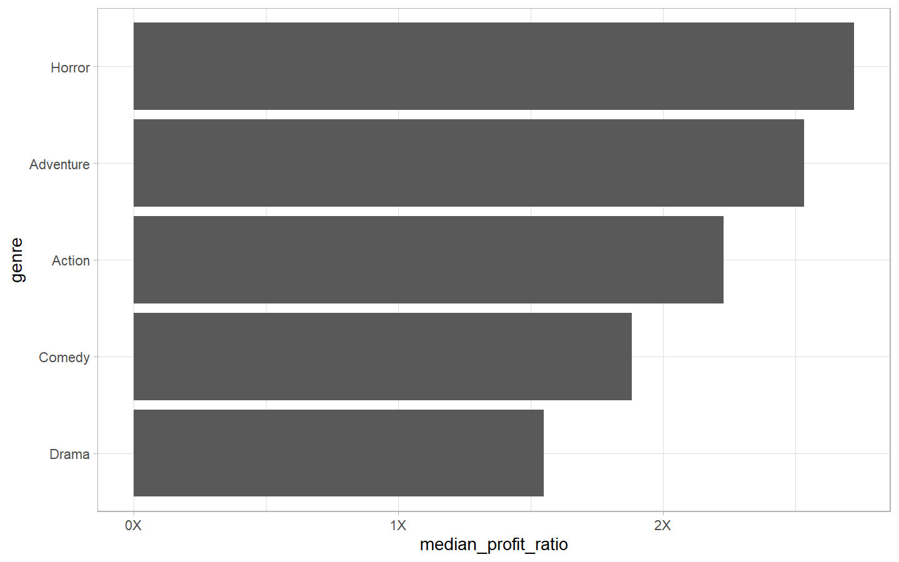<!-- -->

``` r
movie_profit %>% 
  filter(release_date > "2000-01-01") %>% 
  mutate(year = year(release_date)) %>% 
  group_by(genre, year) %>% 
  summarise(median_profit_ratio = median(profit_ratio),
            movies = n()) %>% 
  ungroup() %>% 
  ggplot(aes(year, median_profit_ratio, color = genre)) +
  geom_line(size = 1) +
  scale_y_continuous(labels = function(x) paste0(x, "X"))
```

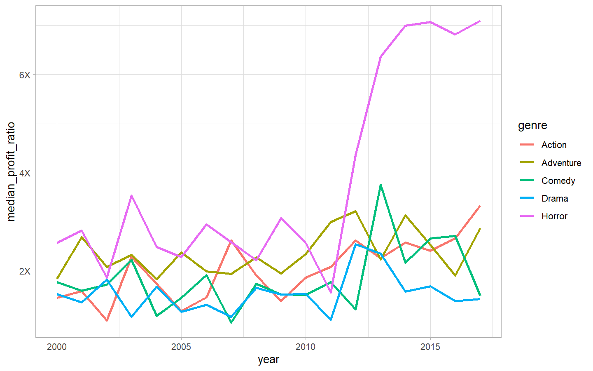<!-- -->

Horror movies started being highly profitable around 2012. What were
some of the most profitable horror movies?

``` r
movie_profit %>% 
  filter(release_date > "1990-01-01",
         genre == "Horror",
         profit_ratio > 0.1) %>% 
  ggplot(aes(release_date, profit_ratio)) +
  geom_point() +
  geom_smooth(method = "lm") +
  geom_text(aes(label = movie, color = distributor), check_overlap = T) +
  scale_y_log10(labels = function(x) paste0(x, "X"), 
                breaks = c(0.1, 1, 10, 100, 500)) +
  labs(title = "Horror movies in terms of profit ratio",
       color = "Distributor")
```

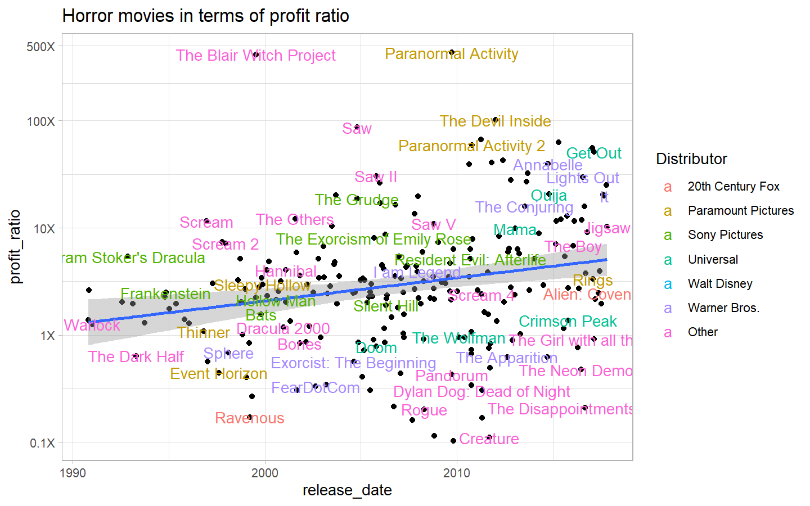<!-- -->

``` r
movie_profit %>% 
  filter(genre == "Horror") %>% 
  arrange(desc(profit_ratio)) %>% 
  head(10) %>% 
  mutate(movie = paste0(movie,"(", year(release_date),")"),
         movie = fct_reorder(movie, profit_ratio)) %>% 
  ggplot(aes(movie, profit_ratio, fill = distributor)) +
  geom_col(alpha = 0.6) +
  coord_flip() +
  scale_y_continuous(labels = function(x) paste0(x, "X")) +
  labs(title = "Top 10 Earning Horror Movies of all time",
       x = "",
       y = "Ratio of worldwide gross earnings by production budget")
```

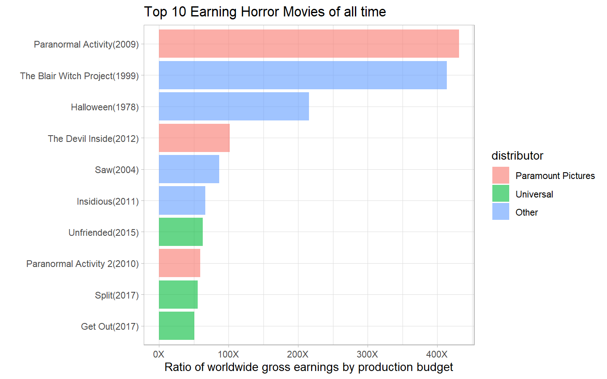<!-- -->

### What are the most common genres over time?

``` r
movie_profit %>% 
  count(Decade, genre) %>%
  group_by(Decade) %>% 
  mutate(ratio = n/sum(n)) %>% 
  ggplot(aes(Decade, ratio, color = genre)) +
  geom_line(size = 1) +
  scale_y_continuous(labels = percent_format())
```

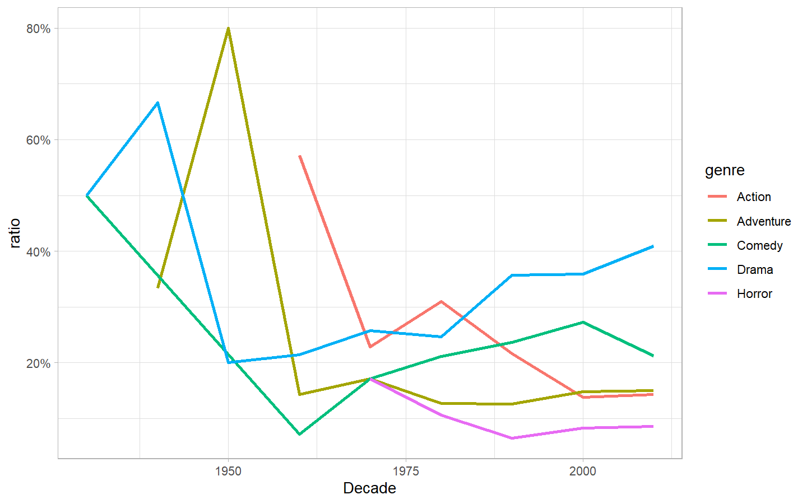<!-- -->

``` r
movie_profit %>% 
  arrange(desc(profit_ratio)) %>% 
  head(10) %>% 
  mutate(movie = paste0(movie,"(", year(release_date),")"),
         movie = fct_reorder(movie, profit_ratio)) %>% 
  ggplot(aes(movie, profit_ratio, fill = genre)) +
  geom_col(alpha = 0.6) +
  coord_flip() +
  scale_y_continuous(labels = function(x) paste0(x, "X")) +
  labs(title = "Which genre most profitable movies come from?",
       x = "",
       y = "Ratio of worldwide gross earnings by production budget",
       fill = "Genre")
```

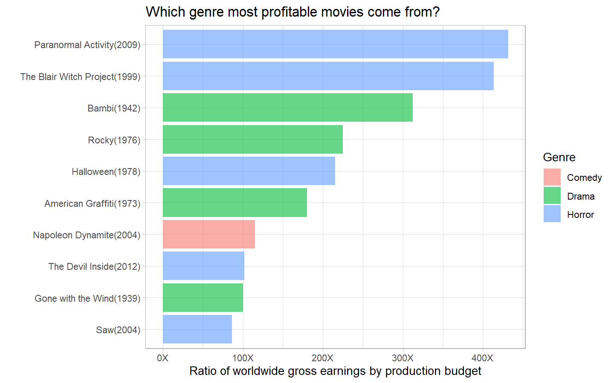<!-- -->

``` r
movie_profit %>% 
  ggplot(aes(genre)) +
  geom_bar(aes(fill = genre), alpha = 0.7) +
  coord_flip() +
  facet_wrap(~ distributor, scales = "free_x") +
  theme(legend.position = "none")
```

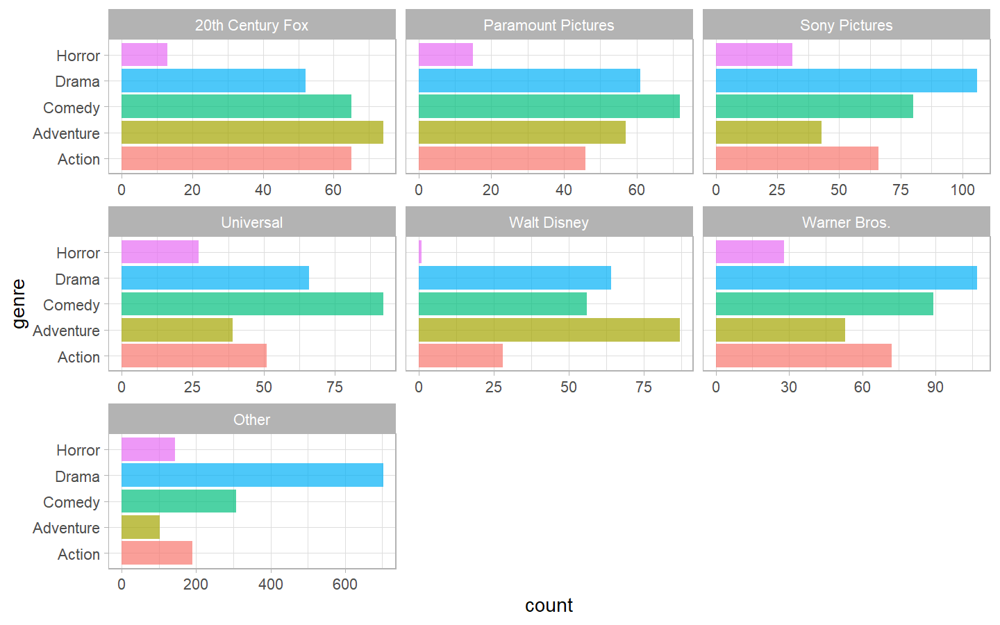<!-- -->

Lets see profitable movies over the years. Which genres are most
profitable?

``` r
movie_profit %>% 
  filter(release_date > "1990-01-01",
         profit_ratio > 0.10) %>% 
  ggplot(aes(release_date, profit_ratio)) +
  geom_point(aes(color = genre)) +
  geom_smooth(method = "lm") +
  geom_text(aes(label = movie, color = genre), hjust = 1,vjust = 1, check_overlap = T, show.legend = F) +
  scale_y_log10(labels = function(x) paste0(x, "X"), 
                breaks = c(0.1, 1, 10, 100, 500)) +
  labs(title = "Movies in terms of their profit ratio over years",
       color = "Distributor") +
  facet_wrap(~genre) +
  theme(legend.position = "none")
```

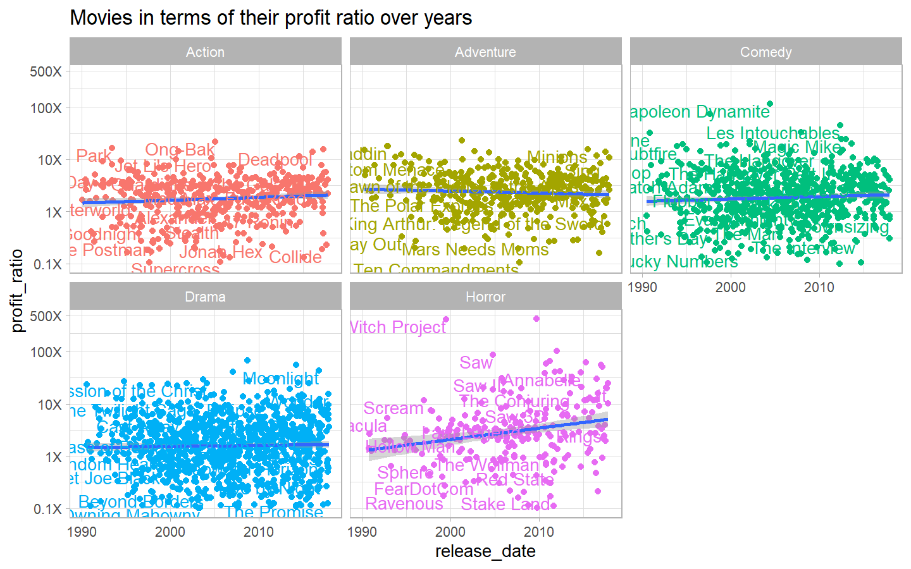<!-- -->

``` r
g <- movie_profit %>% 
  filter(release_date > "1990-01-01",
         profit_ratio > 0.10) %>% 
  ggplot(aes(release_date, profit_ratio, label = movie)) +
  geom_point(aes(color = genre)) +
  geom_smooth(method = "lm") +
  scale_y_log10(labels = function(x) paste0(x, "X"), 
                breaks = c(0.1, 1, 10, 100, 500)) +
  labs(title = "Movies in terms of their profit ratio over years",
       color = "Distributor") +
  facet_wrap(~genre) +
  theme(legend.position = "none")

#ggplotly(g)
```

### End of Report
